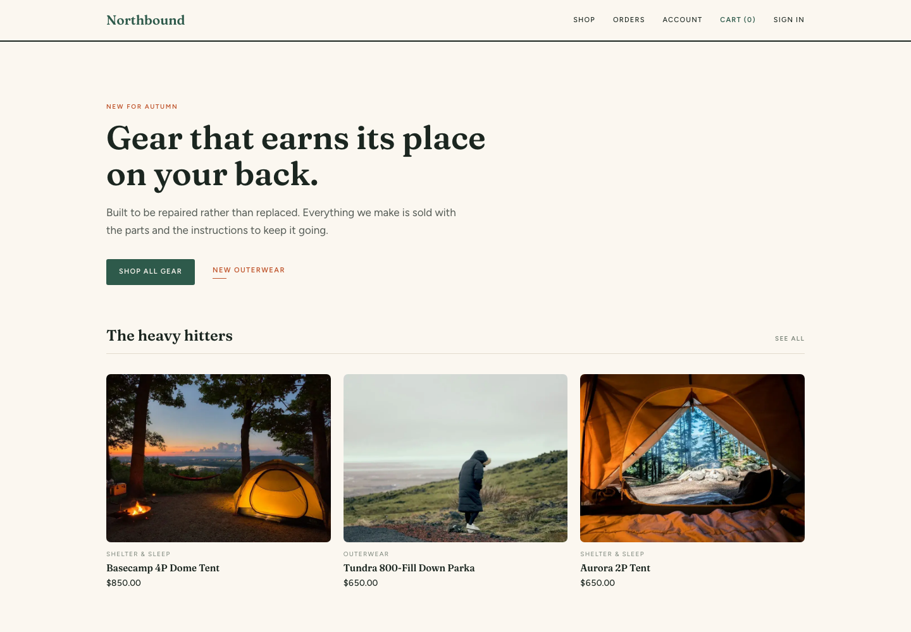

# Northbound

A sample outdoor gear store with a catalog, cart, checkout, order history, and email-and-password sign-in. It shows how [Agent Edge](https://github.com/descope/agent-edge) lets customers' AI agents shop for them with a Descope token, with very few changes to the store.



## Run it

```bash
pnpm install && pnpm db:setup && pnpm dev
```

Open http://localhost:3000. No configuration needed.

| Email | Password |
| --- | --- |
| `alice@example.com` | `alpine-trail-2019` |
| `bob@example.com` | `northbound-legacy-99` |
| `carol@example.com` | `summit-ridge-4410` |

## AI agents

Agent Edge runs in front of the store. It recognizes agents, sends them to the front door for the customer's approval, and blocks payment pages. The store's own sign-in doesn't change. It adds two things:

- **It accepts the agent's token.** [`lib/agentSession/descope.ts`](lib/agentSession/descope.ts) checks the Descope token in the `DS` cookie and signs the agent in as the customer with the same email. The token needs `orders:read` or `orders:write`.
- **It asks before an agent buys.** Agents connect read-only. At checkout, [`lib/agentSession/stepUp.ts`](lib/agentSession/stepUp.ts) sends an agent without `orders:write` to the front door to approve that order.

It also shows which orders an agent placed, which is optional. Checkout saves the token's `act.sub` with the order, and order history marks those orders "By your AI assistant".

Set these in `.env.local`, and run Agent Edge in front of the store (see its [README](https://github.com/descope/agent-edge)):

| Variable | Value |
| --- | --- |
| `DESCOPE_DISCOVERY_URL` | Your Descope inbound app's Discovery URL |
| `DESCOPE_AUDIENCE` | The resource agents' tokens must be for, such as `https://northbound.camp/agent_resource`. Match the front door's `RESOURCE`. |
| `FRONT_DOOR_URL` | The front door, for step-up |
| `STEP_UP_SECRET` | The same value as the front door's |
| `DEMO_AUTO_SIGNUP` | `true` creates an account, with a sample address and test card, the first time a new email approves an agent. For demos. |

### How customers approve

That's up to you, in the Descope approval flow. By default they sign in through Descope, with an email code or Google. If you'd rather they approve with their Northbound account, add the External Authentication action to the flow with `https://<your site>/login` as its URL, and set `DESCOPE_PROJECT_ID` and `DESCOPE_MANAGEMENT_KEY`. Northbound then tells Descope who signed in ([`lib/agentSession/externalAuth.ts`](lib/agentSession/externalAuth.ts)).

## Deploy

SQLite on Vercel doesn't keep writes, so set `DATABASE_URL` to a hosted libsql database such as Turso.

## Scripts

| Command | Does |
| --- | --- |
| `pnpm dev` | Development server |
| `pnpm build` | Production build |
| `pnpm test` | Tests |
| `pnpm db:setup` | Migrate and seed. Safe to re-run. |
| `pnpm db:generate` | Regenerate migrations after a schema change |
